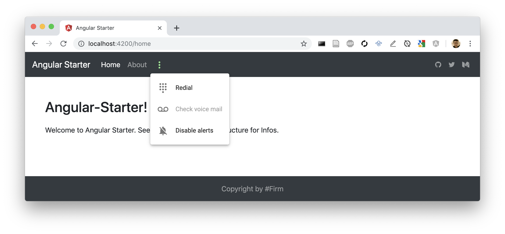

# Angular Starter
This Repo can be used as Angular starter and shows basic content-organization.


### Quickstart
```
git clone git@github.com:fabiankuhn/angular-starter.git
cd angular-starter
npm install
ng serve
```

### Setup Documentation
For Details on the Setup regarding Sass, Normalize, Bootstrap click here. [Installation Config Documentation](docs/setup.md)

### Content
Integrated tech:
- Angular CLI
- Angular Material
- Bootstrap
- Normalize SCSS
- Global SCSS Organisation

### Structure of Project
```
├── app
│   ├── pages
│   │   ├── about
│   │   └── landing
│   └── shared
│       ├── component
│       │   ├── footer
│       │   └── header
│       ├── directives
│       ├── model
│       └── service
├── assets
│   └── image
├── environments
└── styles

```

### Angular Documentation

- Dev Server: Run `ng serve` for a dev server. Navigate to `http://localhost:4200/`. The app will automatically reload if you change any of the source files.
- Generate Component: Run `ng generate component component-name` to generate a new component. You can also use `ng generate directive|pipe|service|class|guard|interface|enum|module`.
- Build Project: Run `ng build` to build the project. The build artifacts will be stored in the `dist/` directory. Use the `--prod` flag for a production build.
- Run Unit Tests: Run `ng test` to execute the unit tests via [Karma](https://karma-runner.github.io).
- Run End to End Tests: Run `ng e2e` to execute the end-to-end tests via [Protractor](http://www.protractortest.org/).
- Further help: To get more help on the Angular CLI use `ng help` or go check out the [Angular CLI README](https://github.com/angular/angular-cli/blob/master/README.md).
